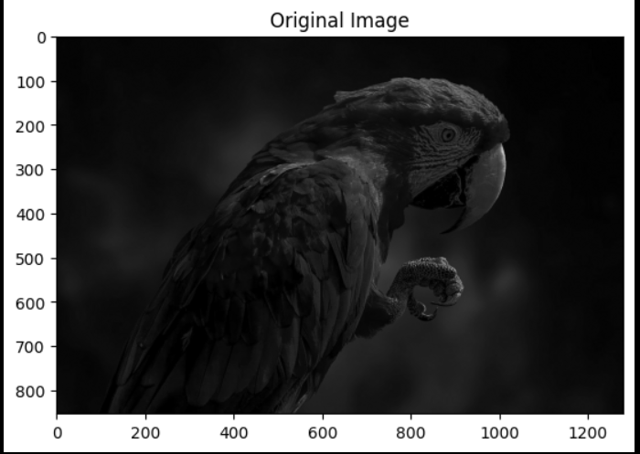
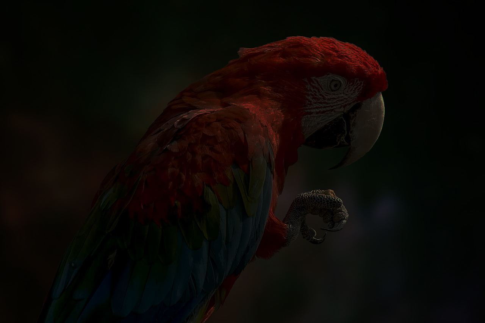
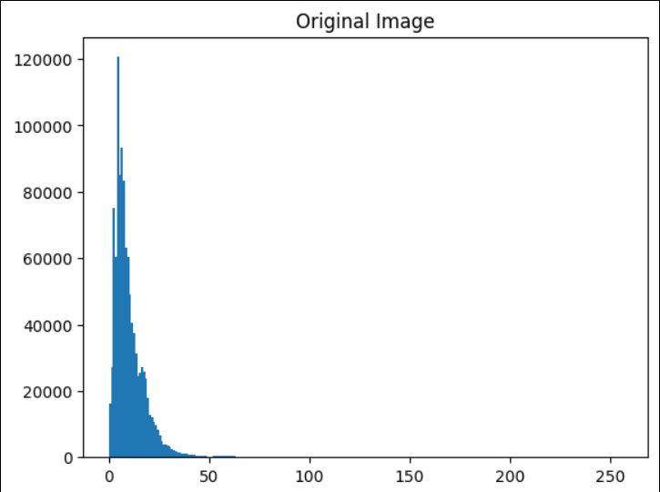
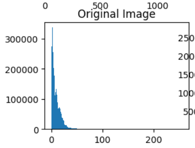
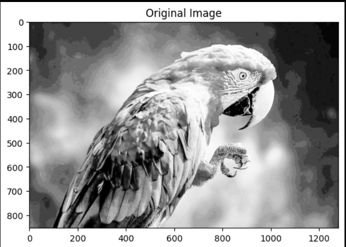
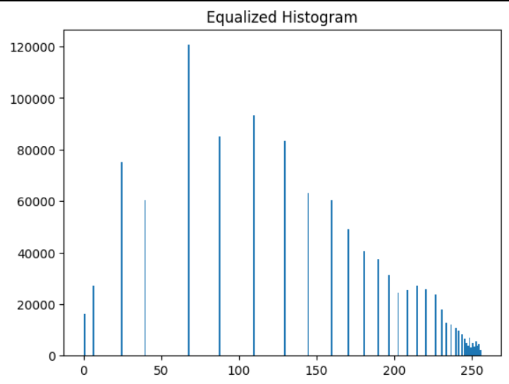
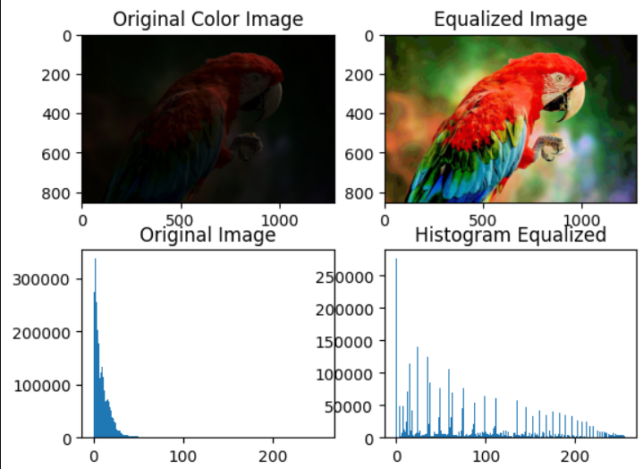

# Histogram-of-an-images
## Aim
To obtain a histogram for finding the frequency of pixels in an Image with pixel values ranging from 0 to 255. Also write the code using OpenCV to perform histogram equalization.

## Software Required:
Anaconda - Python 3.7

## Algorithm:
### Step1:
Read the gray and color image using imread()

### Step2:
Print the image using imshow().

### Step3:
Use calcHist() function to mark the image in graph frequency for gray and color image.

### step4:
Use calcHist() function to mark the image in graph frequency for gray and color image.

### Step5:
The Histogram of gray scale image and color image is shown.


## Program:
```python
# Developed By: Navinkumar V
# Register Number: 212223230141

import cv2
import numpy as np
import matplotlib.pyplot as plt
img = cv2.imread('parrot.jpg', cv2.IMREAD_GRAYSCALE)
img2 = cv2.imread('parrot.jpg', cv2.IMREAD_GRAYSCALE)

plt.imshow(img, cmap='gray')
plt.title('Original Image')
plt.show()

assert np.array_equal(img, img2)
plt.hist(img.ravel(),256,range = [0, 256])
plt.title('Original Image')
plt.show()

img_eq = cv2.equalizeHist(img)
plt.hist(img_eq.ravel(), 256, range = [0, 256])
plt.title('Equalized Histogram')

plt.imshow(img_eq, cmap='gray')
plt.title('Original Image')
plt.show()

img = cv2.imread('parrot.jpg', cv2.IMREAD_COLOR)
img_hsv = cv2.cvtColor(img, cv2.COLOR_BGR2HSV)
img_hsv[:,:,2] = cv2.equalizeHist(img_hsv[:, :, 2])
img_eq = cv2.cvtColor(img_hsv, cv2.COLOR_HSV2BGR)

plt.imshow(img_eq[:,:,::-1])
plt.title('Equalized Image')
plt.show()

plt.hist(img_eq.ravel(),256,range = [0, 256])
plt.title('Histogram Equalized')
plt.show()

plt.subplot(221); plt.imshow(img[:, :, ::-1]); plt.title('Original Color Image')
plt.subplot(222); plt.imshow(img_eq[:, :, ::-1]); plt.title('Equalized Image')
plt.subplot(223); plt.hist(img.ravel(),256,range = [0, 256]); plt.title('Original Image')
plt.subplot(224); plt.hist(img_eq.ravel(),256,range = [0, 256]); plt.title('Histogram Equalized');plt.show()

plt.figure(figsize = [15,4])
plt.subplot(121); plt.hist(img.ravel(),256,range = [0, 256]); plt.title('Original Image')
plt.subplot(122); plt.hist(img_eq.ravel(),256,range = [0, 256]); plt.title('Histogram Equalized')
```
## Output:
### Input Grayscale Image and Color Image



### Histogram of Grayscale Image and any channel of Color Image



### Histogram Equalization of Grayscale Image.




## Result: 
Thus the histogram for finding the frequency of pixels in an image with pixel values ranging from 0 to 255 is obtained. Also,histogram equalization is done for the gray scale image using OpenCV.
